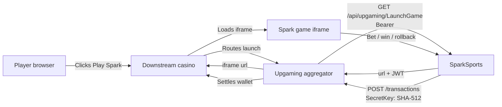

If your casino sits behind an aggregator platform, the platform handles the integration with Spark. You build no wallet or session endpoints. The aggregator calls Spark, and Spark calls the aggregator. This page describes that path so the aggregator's integration team knows what Spark hosts and what we call back.

<Callout type="info">**Live aggregator: Upgaming.** The wire shapes on this page are Upgaming's. A second aggregator would get its own adapter and its own page here; there is no generic aggregator contract.</Callout>

## How it fits together



Two differences from the [operator integration](/docs/operator-integration/launch):

1. The aggregator calls our launch endpoint. We do not call the casino.
2. Wallet settlement goes to the aggregator's wallet, not the casino's. The casino never sees `/api/transaction/process`.

## Who builds what

| Component | Owner |
| --- | --- |
| Spark game iframe | SparkSports |
| Launch, GetGames, GetGameHistory endpoints | SparkSports hosts; the aggregator calls them |
| Wallet (`/balance`, `/transactions`, `/rollback`) | The aggregator hosts; Spark calls them |
| Downstream casino lobby and player account | The casino (no Spark-specific build) |

If you are a downstream casino reading this, stop here. Ask your aggregator platform to enable Spark. You do not implement anything in these docs.

## Endpoints Spark hosts

All `/api/upgaming/*` endpoints require a Bearer token we issue to the aggregator during onboarding:

```http
Authorization: Bearer <token>
```

Tokens use the `spark_<environment>.<secret>` format. We rotate them with you, not at you: the old token stays valid until you confirm the new one in production logs.

### GET /api/upgaming/LaunchGame

Called when a player opens Spark through the aggregator. Returns the iframe URL.

Query parameters (mixed casing is intentional, the aggregator sends them exactly as below):

| Parameter | Required | Description |
| --- | --- | --- |
| `operatorId` | Yes | Aggregator operator identifier |
| `casinoPlayerId` | Yes | Stable player id on the aggregator side |
| `casinoSessionId` | Yes | Opaque session id. Treated as a plain string |
| `gameId` | Yes | Game id on the provider system. String, not integer |
| `currency` | Yes | ISO 4217 code |
| `lobbyUrl` | Yes | URL we return the player to |
| `device` | Yes | `MOBILE` or `DESKTOP` |
| `locale` | Yes | ISO 639-1, two characters, sent uppercase |
| `isDemo` | No | `True` or `False` (Pascal case). Omitted means real play |
| `countryCode` | No | ISO 3166-1 alpha-2 |

Response:

```json
{
  "url": "https://launch.sparksports.ai/g/eyJhbGc..."
}
```

The URL carries a short-lived JWT. Load it in an iframe immediately.

Errors use `{ "code", "message" }`:

| HTTP | `code` | When |
| --- | --- | --- |
| `400` | `UNSUPPORTED_CURRENCY` | Currency is not on the supported list |
| `401` | `UNAUTHORIZED` | Bad or missing Bearer token, or an unrecognized operator routing identifier |
| `500` | `OPERATOR_NOT_PROVISIONED` | Operator row missing or inactive on our side |
| `503` | `MAINTENANCE_MODE` | Launch disabled for maintenance |

### GET /api/upgaming/GetGames

Returns the games Spark exposes to this aggregator. The catalog is locked to one entry, Spark.

Query parameters:

| Parameter | Required | Description |
| --- | --- | --- |
| `key` | Yes | Aggregator operator identifier |

Response:

```json
[
  {
    "id": "1",
    "name": "Spark",
    "demoavailable": false,
    "mobilesupport": true,
    "freespinsupport": false,
    "providerid": 2110,
    "type": "livesports",
    "imagelink": "https://domain.com/image.png"
  }
]
```

### GET /api/upgaming/GetGameHistory

Returns a history URL for a player's round. Used by the aggregator's round-history UI.

Query parameters (mixed casing again):

| Parameter | Required | Description |
| --- | --- | --- |
| `operatorId` | Yes | Aggregator operator identifier |
| `roundId` | Yes | Same value we used as `roundid` in `/transactions` |
| `casinoplayerid` | No | Player id |
| `gameId` | No | Game id |
| `transactionDate` | No | UTC timestamp |

Response:

```json
{
  "historyUrl": "https://..."
}
```

### POST /api/upgaming/AddFreeBet and /CancelFreeBet

Return `501 FEATURE_NOT_SUPPORTED`. Spark is a streak game and has no free-spin model. The endpoints exist so the aggregator's standard catalog wiring does not break; the bodies are accepted but ignored.

## What Spark calls (wallet side)

Spark calls the aggregator's wallet during play. These are the aggregator's endpoints, documented in the aggregator's own spec, so we only summarize the surface here:

| Endpoint | Method | Purpose |
| --- | --- | --- |
| `/balance` | POST | Read live balance |
| `/transactions` | POST | Bet (debit) or win (credit) |
| `/rollback` | POST | Refund the original bet |

Authentication is a per-endpoint SHA-512 signature sent in the `SecretKey` header. The signed fields differ per endpoint, so each is signed with its own formula. We hold the hash key on our side and never put it on the wire.

Money is sent as decimal JSON numbers, the same convention as the operator path. `isRoundFinished` closes a round. We deduplicate on our transaction id, and retries never double-charge or double-credit.

## IP allowlisting

We enforce an inbound IP allowlist on `/api/upgaming/*`, checked before the Bearer token. Requests from an IP outside the allowlist get `403 Forbidden`, not `401 Unauthorized`. Send us your egress IPs during onboarding so we can add them; an aggregator with no allowlisted IPs on our side cannot reach any `/api/upgaming/*` endpoint.

## Onboarding deliverables

We send the aggregator team, per environment:

| Item | Description |
| --- | --- |
| Inbound Bearer token | Token the aggregator sends us on `/api/upgaming/*` |
| Provider id | The aggregator's provider id for Spark |
| Game id | The game id used in `/transactions` and `/rollback` |
| Hash key | Secret used to sign outbound wallet calls (held by us, never shared on the wire) |
| Supported currencies | Currencies Spark will accept on LaunchGame |
| Staging environment | For dev and QA before production |

Limits (max win amount, max multiplier, stake bounds per currency) are configured per operator on our side and sent to the game at launch.

## Get started

Ask your SparkSports contact for staging credentials and a routing profile. If you are a downstream casino, ask your aggregator platform to enable Spark instead. You do not need anything from these pages.
