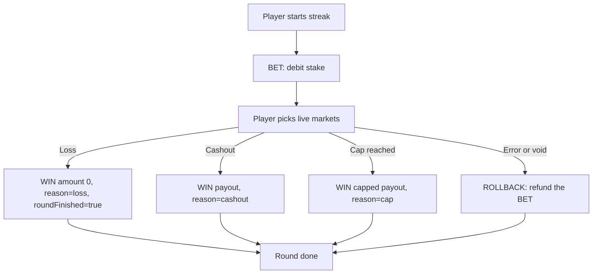

Each round gets a `roundId`. Most rounds have one `BET` and one `WIN` or `ROLLBACK`. A losing round still ends with a `WIN` of amount `0`, flagged so it reads as a close, not a payout.

## Flow

{/* v1: was an ASCII tree. WHY: replaced with a Mermaid flowchart (renders to SVG at build time, see how-it-works) so every flow on the site is a real diagram. Types are words; the loss path now shows reason=loss + amount 0 instead of a bare "Win, amount=0". */}

## Transaction types

{/* v1: numeric Type column dropped; words only. */}

| Type | Action | When |
| --- | --- | --- |
| `BET` | Debit | New streak starts |
| `WIN` | Credit | Cashout, cap, or losing close (amount `0`) |
| `ROLLBACK` | Refund | A `BET` must be reversed |

## Linking settlements to the bet

{/* v1: NEW section. WHY: previously nothing tied a WIN/ROLLBACK back to its BET, so reconciliation relied on roundId alone. */}

A `WIN` or `ROLLBACK` carries `betTransactionId`, the `transactionId` of the `BET` it settles or reverses. Use it to reconcile, and to make sure a `ROLLBACK` reverses exactly the right debit.

## Typical sequence

1. Player opens Spark. Your backend calls [Launch](/docs/direct-integration/launch).
2. We call your [Session validation](/docs/direct-integration/session-validation).
3. Player starts a streak. `BET` debits the stake.
4. Player picks through live steps.
5. Cashout, cap, or loss: `WIN` credits the payout (`0` on loss), with `reason` and `roundFinished`.
6. Void or error: `ROLLBACK` refunds the original `BET`, referenced by `betTransactionId`.

## Retries

We retry wallet calls when the failure looks transient (`5xx` or timeout). Your handler must be idempotent on `transactionId` so a retry never double-charges or double-credits. See [Wallet API retries](/docs/direct-integration/wallet-api#retries).
