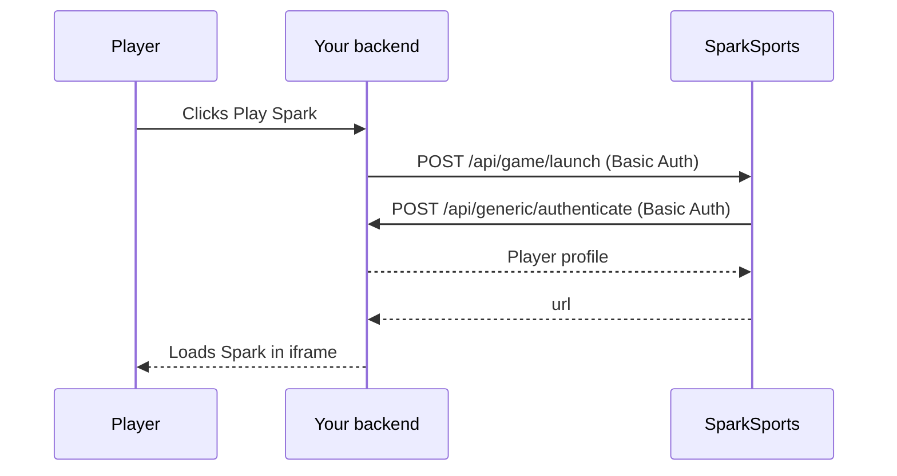
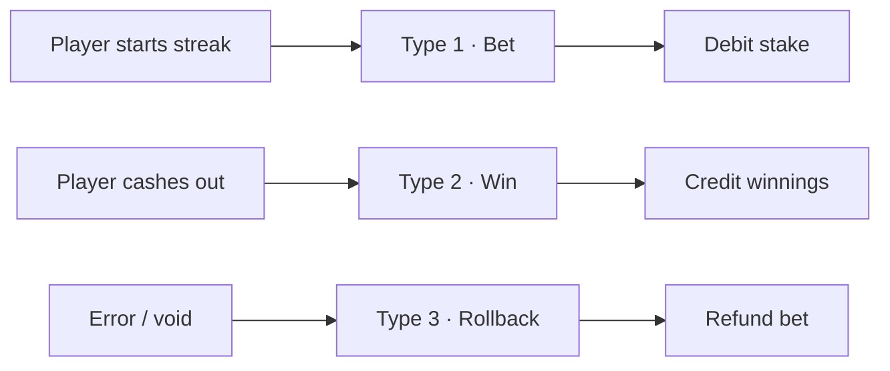

Spark integrates with casinos in two ways. Which one you use depends on whether your casino connects directly or through an aggregator platform.

## Two integration paths

| Path | Who calls who | Who builds wallet endpoints |
| --- | --- | --- |
| [Operator integration](/docs/operator-integration/launch) | You call our launch API; we call your wallet and session endpoints | You do |
| [Aggregator integration](/docs/aggregator-integration/overview) | The aggregator calls our launch API; we call the aggregator's wallet | The aggregator does |

The rest of this page describes the operator path. For the aggregator path, see [Aggregator integration](/docs/aggregator-integration/overview).

## Operator integration: components

| Component | Owner | Role |
| --- | --- | --- |
| Your casino backend | You | Calls our launch API; exposes session and wallet endpoints |
| SparkSports launcher | SparkSports | Validates sessions, returns launch URLs |
| Spark game iframe | SparkSports | The game UI in your lobby |
| Your wallet API | You | Debits stakes, credits wins, handles rollbacks |

## Operator integration: launch flow

A player clicks "Play Spark" in your lobby. Four steps run before the game loads.



Your backend calls `POST /api/game/launch` with HTTP Basic Auth:

```json
{
  "SessionId": "your-player-session-id"
}
```

We validate that session by calling your `POST /api/generic/authenticate` with the same `SessionId`. Your endpoint returns the player profile:

```json
{
  "SessionId": "your-player-session-id",
  "Pincode": "player-unique-id",
  "Username": "john_doe",
  "Balance": 1500.00,
  "Currency": "USD",
  "Country": "US"
}
```

If the session is valid, we return the iframe URL:

```json
{
  "url": "https://spark.sparksports.ai/game/sparksports?jwt=eyJhbGci..."
}
```

| Field | Description |
| --- | --- |
| `url` | Full HTTPS URL to load Spark in an iframe. The `jwt` query parameter is a signed, short-lived launch token, not your player's `SessionId`. Pass this URL to your frontend and embed it immediately. |

<BrandCallout title="Request the URL right before embedding">
  The token expires in about 30 seconds. Call launch synchronously when the player opens Spark, then load the `url` immediately. Do not pre-fetch or cache the URL.
</BrandCallout>

Full field tables and error codes are in [Launch the game](/docs/operator-integration/launch) and [Session validation](/docs/operator-integration/session-validation).

## Operator integration: wallet flow

SparkSports calls your wallet API during play. We wait for your response before moving on.



See [Wallet API](/docs/operator-integration/wallet-api) and [Transaction lifecycle](/docs/operator-integration/transaction-lifecycle).

## Operator integration: endpoints you implement

| Endpoint | Method | Purpose |
| --- | --- | --- |
| `/api/generic/authenticate` | POST | Validate player session at launch |
| `/api/generic/user/{pincode}/balance` | GET | Return live balance |
| `/api/transaction/process` | POST | Bet, win, rollback |

All callback endpoints use HTTP Basic Auth with the callback credentials from onboarding.

## What SparkSports sends you

What you receive during onboarding depends on the path:

| Path | Credentials |
| --- | --- |
| Operator integration | Basic Auth username and password for launch, and Basic Auth username and password we use when calling your wallet API |
| Aggregator integration | A Bearer token the aggregator sends us, plus a hash key we use to sign wallet calls to the aggregator |

## Limits and win caps

We configure stake limits and win caps with you during onboarding. Tell us the bounds you want:

| Limit | What it controls |
| --- | --- |
| Min stake | Lowest amount a player can bet to start a streak (per currency) |
| Max stake | Highest amount a player can bet to start a streak (per currency) |
| Max multiplier | Highest multiplier a streak can reach before the game force-cashes out |
| Max win amount | Highest payout allowed for a single round, in the player's session currency |

Min and max stake are set per currency. Max multiplier and max win amount are operator-wide caps we store on our side and convert into the session currency at launch.

The game loads all of these when a session starts and enforces them during play. A streak ends automatically when it hits either cap, whichever comes first. Payout is `stake x multiplier`, capped at the max win amount.

No SDK. Just HTTPS endpoints on both sides.
