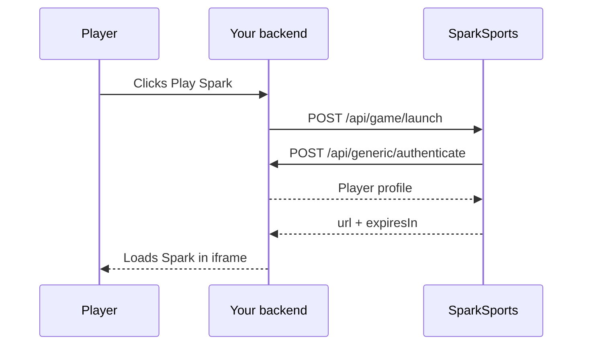

You host session validation and wallet settlement. SparkSports hosts the launch service and the Spark iframe.

## Components

| Component | Owner | Role |
| --- | --- | --- |
| Your casino backend | You | Calls our launch API; exposes session and wallet endpoints |
| SparkSports launcher | SparkSports | Validates sessions, returns launch URLs |
| Spark game iframe | SparkSports | The game UI in your lobby |
| Your wallet API | You | Debits stakes, credits wins, handles rollbacks |

## Launch flow

A player clicks "Play Spark" in your lobby. Four steps run before the game loads.



Your backend calls `POST /api/game/launch` with HTTP Basic Auth:

```json
{
  "SessionId": "your-player-session-id"
}
```

We validate that session by calling your `POST /api/generic/authenticate` with the same `SessionId`. Your endpoint returns the player profile:

```json
{
  "SessionId": "your-player-session-id",
  "Pincode": "player-unique-id",
  "Username": "john_doe",
  "Balance": 1500.00,
  "Currency": "USD",
  "Country": "US"
}
```

If the session is valid, we return the iframe URL:

```json
{
  "url": "https://staging.spark.sparksports.ai/game/sparksports?jwt=eyJhbGci...",
  "expiresIn": 30
}
```

Your frontend loads that URL in an iframe. The token is short-lived, so request a new URL each session.

Full field tables and error codes are in [Launch the game](/docs/direct-integration/launch) and [Session validation](/docs/direct-integration/session-validation).

## Wallet flow

SparkSports calls your wallet API during play. We wait for your response before moving on.

```
Player starts streak   → Type 1 (Bet)      debit stake
Player cashes out      → Type 2 (Win)      credit winnings
Error / void           → Type 3 (Rollback) refund bet
```

See [Wallet API](/docs/direct-integration/wallet-api) and [Transaction lifecycle](/docs/direct-integration/transaction-lifecycle).

## Endpoints you implement

| Endpoint | Method | Purpose |
| --- | --- | --- |
| `/api/generic/authenticate` | POST | Validate player session at launch |
| `/api/generic/user/{pincode}/balance` | GET | Return live balance |
| `/api/transaction/process` | POST | Bet, win, rollback |

## What SparkSports sends you

| Item | Description |
| --- | --- |
| Launch credentials | HTTP Basic Auth for `POST /api/game/launch` |
| Callback credentials | Auth we use when calling your wallet API |
| Staging environment | For dev and QA before production |
| Operator limits | Stake bounds, win caps, currency settings |

No SDK. Just HTTPS endpoints on both sides.
