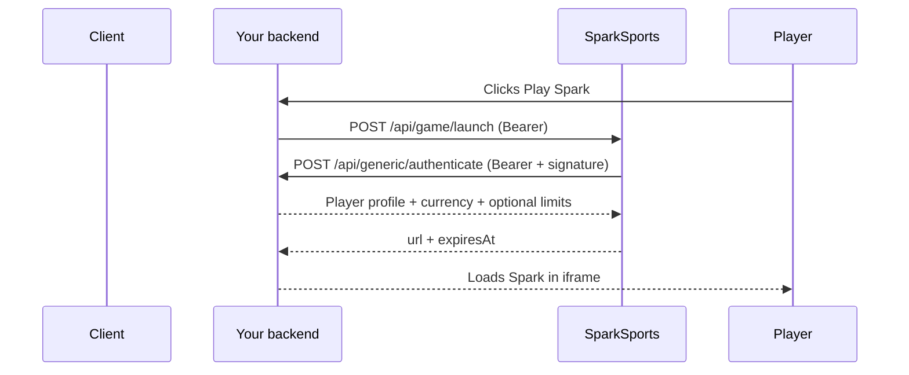
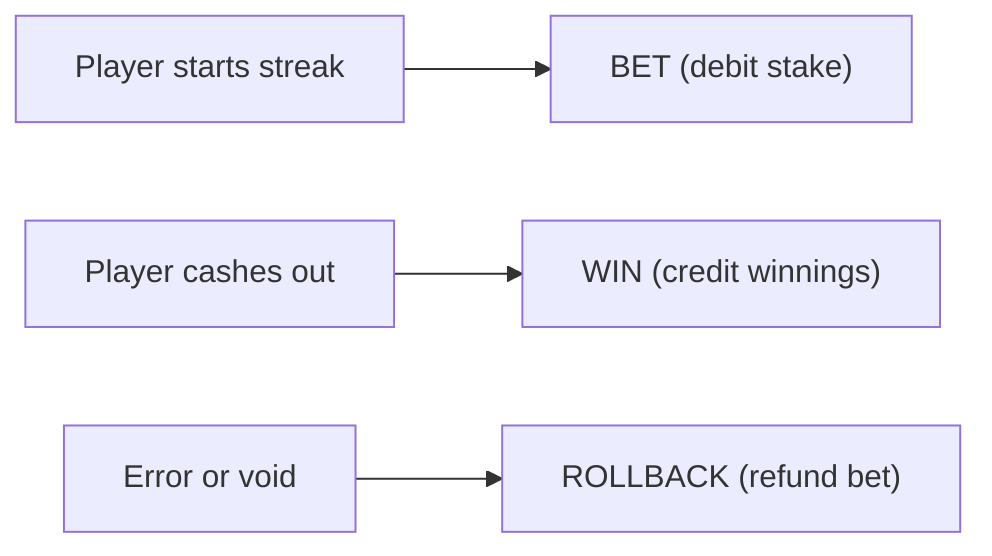

You host session validation and wallet settlement. SparkSports hosts the launch service and the Spark iframe.

## Components

| Component | Owner | Role |
| --- | --- | --- |
| Your casino backend | You | Calls our launch API; exposes session and wallet endpoints |
| SparkSports launcher | SparkSports | Validates sessions, returns launch URLs |
| Spark game iframe | SparkSports | The game UI in your lobby |
| Your wallet API | You | Debits stakes, credits wins, handles rollbacks |

## Launch flow

A player clicks "Play Spark" in your lobby. Four steps run before the game loads.



Your backend calls `POST /api/game/launch` with a Bearer token:

```json
{
  "sessionId": "your-player-session-id"
}
```

We validate that session by calling your `POST /api/generic/authenticate` with the same `sessionId`. Your endpoint returns the player profile:

```json
{
  "sessionId": "your-player-session-id",
  "playerId": "player-unique-id",
  "username": "john_doe",
  "balance": "1500.00",
  "currency": "USD",
  "country": "US",
  "limits": {
    "minStake": "1.00",
    "maxStake": "100.00"
  }
}
```

If the session is valid, we return the iframe URL:

```json
{
  "url": "https://staging.spark.sparksports.ai/game/sparksports?jwt=eyJhbGci...",
  "expiresAt": 1782763200
}
```

| Field | Description |
| --- | --- |
| `url` | Full HTTPS URL to load Spark in an iframe. The `jwt` query parameter is a signed, short-lived launch token, not your player's `sessionId`. Pass this URL to your frontend and embed it immediately. |
| `expiresAt` | Token expiry as a UNIX timestamp in seconds. Same value as the JWT `exp` claim. After it expires the URL is rejected; call launch again for a fresh one. |

Full field tables and error codes are in [Launch the game](/docs/direct-integration/launch) and [Session validation](/docs/direct-integration/session-validation).

## Wallet flow

SparkSports calls your wallet API during play. We wait for your response before moving on.



See [Wallet API](/docs/direct-integration/wallet-api) and [Transaction lifecycle](/docs/direct-integration/transaction-lifecycle).

## Endpoints you implement

| Endpoint | Method | Purpose |
| --- | --- | --- |
| `/api/generic/authenticate` | POST | Validate player session at launch |
| `/api/generic/user/{playerId}/balance` | GET | Return live balance |
| `/api/transaction/process` | POST | Bet, win, rollback |

Your callback endpoints use Bearer auth plus `X-Spark-Signature`, `X-Spark-Timestamp`, and `X-Spark-Request-Id`.

## What SparkSports sends you

| Item | Description |
| --- | --- |
| Launch credentials | Bearer token for `POST /api/game/launch` |
| Callback credentials | Bearer token + HMAC-SHA256 signing secret for our calls to your callback endpoints |
| Staging environment | For dev and QA before production |
| Stake limits | Minimum and maximum stake per currency, plus preset amounts for the in-game stake picker |
| Win caps | Maximum streak multiplier and maximum payout amount per round |

We configure stake limits and win caps with you during onboarding. Tell us the bounds you want:

| Limit | What it controls |
| --- | --- |
| Min stake | Lowest amount a player can bet to start a streak (per currency) |
| Max stake | Highest amount a player can bet to start a streak (per currency) |
| Max multiplier | Highest multiplier a streak can reach before the game force-cashes out |
| Max win amount | Highest payout allowed for a single round, in the player's session currency |

Min and max stake are set per currency. Max multiplier and max win amount are operator-wide caps we store on our side and convert into the session currency at launch.

The game loads all of these when a session starts and enforces them during play. A streak ends automatically when it hits either cap, whichever comes first. Payout is `stake × multiplier`, capped at the max win amount.

No SDK. Just HTTPS endpoints on both sides.
