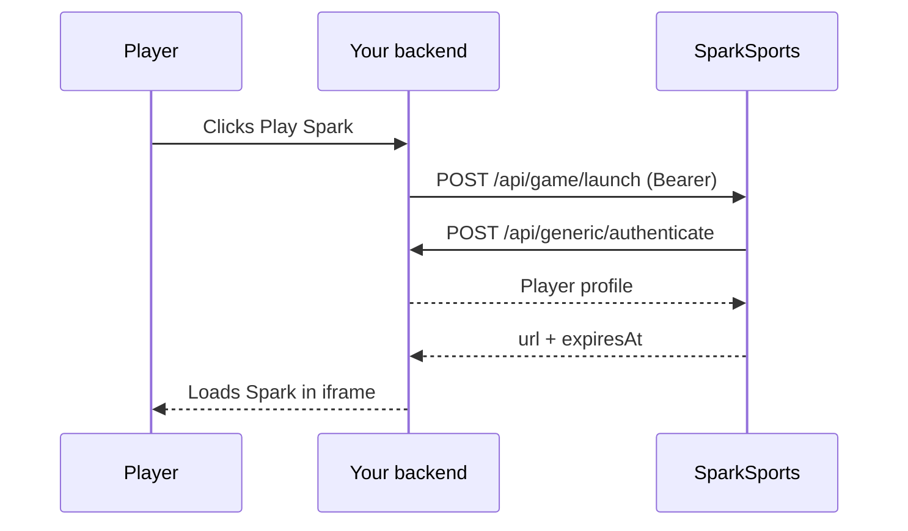
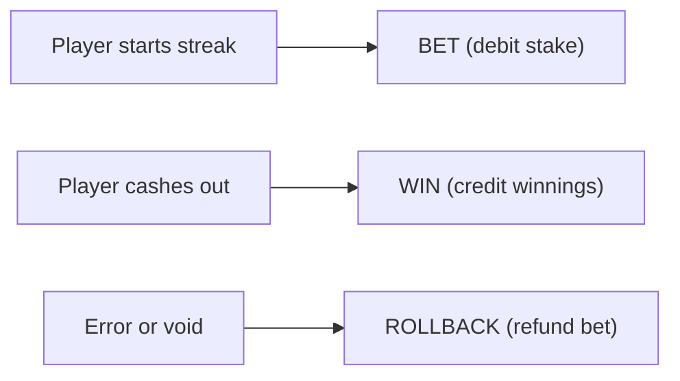

You host session validation and wallet settlement. SparkSports hosts the launch service and the Spark iframe.

## Components

| Component | Owner | Role |
| --- | --- | --- |
| Your casino backend | You | Calls our launch API; exposes session and wallet endpoints |
| SparkSports launcher | SparkSports | Validates sessions, returns launch URLs |
| Spark game iframe | SparkSports | The game UI in your lobby |
| Your wallet API | You | Debits stakes, credits wins, handles rollbacks |

## Launch flow

A player clicks "Play Spark" in your lobby. Four steps run before the game loads.



{/* v1: diagram updated: launch is Bearer (was Basic Auth), response is expiresAt (was url + expiresIn). */}

Your backend calls `POST /api/game/launch` with a Bearer token:

```json
{
  "sessionId": "your-player-session-id"
}
```

We validate that session by calling your `POST /api/generic/authenticate` with the same `sessionId`. Your endpoint returns the player profile:

```json
{
  "sessionId": "your-player-session-id",
  "playerId": "player-unique-id",
  "username": "john_doe",
  "balance": 1500.00,
  "currency": "USD",
  "country": "US"
}
```

If the session is valid, we return the iframe URL:

```json
{
  "url": "https://staging.spark.sparksports.ai/game/sparksports?jwt=eyJhbGci...",
  "expiresAt": 1782763200
}
```

Your frontend loads that URL in an iframe. The token is short-lived, so request a new URL each session.

Full field tables and error codes are in [Launch the game](/docs/direct-integration/launch) and [Session validation](/docs/direct-integration/session-validation).

## Wallet flow

SparkSports calls your wallet API during play. We wait for your response before moving on.

{/* v1: was an ASCII block with numeric Type 1/2/3. WHY: real diagram + word types, consistent with the rest of v1. */}



See [Wallet API](/docs/direct-integration/wallet-api) and [Transaction lifecycle](/docs/direct-integration/transaction-lifecycle).

## Endpoints you implement

| Endpoint | Method | Purpose |
| --- | --- | --- |
| `/api/generic/authenticate` | POST | Validate player session at launch |
| `/api/generic/user/{playerId}/balance` | GET | Return live balance |
| `/api/transaction/process` | POST | Bet, win, rollback |

## What SparkSports sends you

| Item | Description |
| --- | --- |
| Launch credentials | Bearer token for `POST /api/game/launch` |
| Callback credentials | Bearer token + signing secret for our calls to your wallet API |
| Staging environment | For dev and QA before production |
| Operator limits | Stake bounds, win caps, currency settings |

No SDK. Just HTTPS endpoints on both sides.
