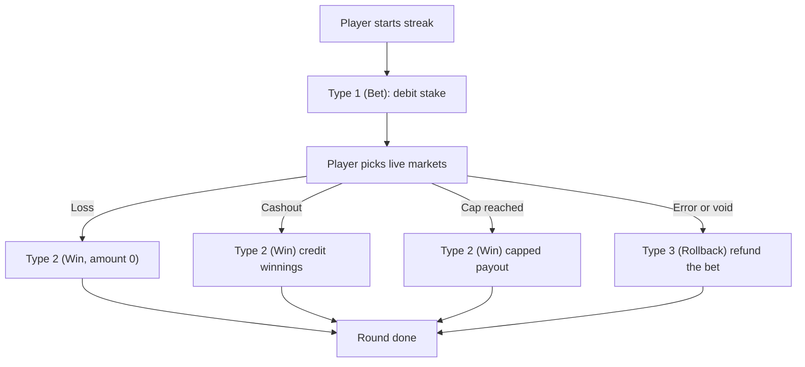

Each round gets a `RoundId`. One round maps to one streak: exactly one Type 1 bet and one closing transaction. The closing transaction is either a Type 2 win (including a zero-amount win on a loss) or a Type 3 rollback. There are no multiple bets or multiple settlements for the same `RoundId`.

`RoundId` is a UUID. One is generated per streak.

<Callout type="info">**Proposed: v1 (draft).** A future contract renames `Type` 1/2/3 to `BET`/`WIN`/`ROLLBACK`, sends amounts as decimal strings with `currency` on every transaction, and links a win or rollback to the originating bet with `betTransactionId` plus a `reason` field. Not live yet. See the [Changelog](/docs/changelog).</Callout>

## Flow

## Transaction types

| Type | Action | When |
| --- | --- | --- |
| `1` | Debit | New streak starts |
| `2` | Credit | Cashout, cap, or round ends. Amount is `0` on a loss |
| `3` | Refund | Bet must be reversed. Always refunds the full original stake, never a partial amount |

## Typical sequence

1. Player opens Spark. Your backend calls [Launch](/docs/operator-integration/launch).
2. We call your [Session validation](/docs/operator-integration/session-validation).
3. Player starts a streak. Type 1 debits the stake.
4. Player picks through live steps.
5. Cashout or loss: Type 2 credits the winnings (`0` on loss).
6. Void or error: Type 3 refunds the original bet.

## Retries

We retry wallet calls only when your response body contains `ErrorCode: 99`, up to 3 total attempts with 1s and 2s delays. Network failures and 5xx without `ErrorCode: 99` are not retried. Your handler must be idempotent on `ExternalTransactionId` so a retry never double-charges or double-credits. See [Wallet API retries](/docs/operator-integration/wallet-api#retries).
