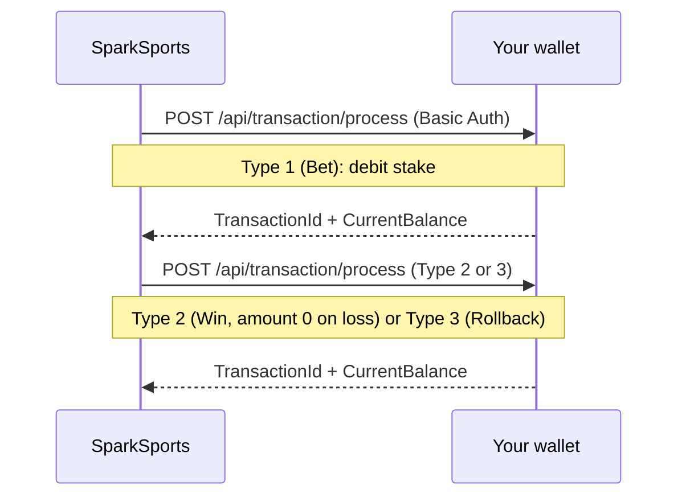

While someone is playing Spark, we call your wallet API to move money. Every call is synchronous: we send the request, wait for your response, then continue or show an error to the player.

<Callout type="info">**Proposed: v1 (draft).** A future contract replaces Basic Auth with a Bearer token plus a per-request signature, switches numeric `Type` to `BET`/`WIN`/`ROLLBACK`, sends money as decimal strings with `currency` on every object, and routes on HTTP status with string error codes. Not live yet. See the [Changelog](/docs/changelog).</Callout>



## Authentication

HTTP Basic Auth on all wallet endpoints, using the callback credentials from onboarding.

## Get balance

We call this when we need a fresh balance during play.

```
GET {your-callback-base-url}/api/generic/user/{pincode}/balance?sessionId={sessionId}
```

`pincode` is lowercase in the URL path. The transaction body uses `PinCode` with a capital C. `sessionId` is required. Your callback base URL may include a path prefix; we strip trailing slashes.

Response:

```json
{
  "Balance": 1500.00
}
```

<TypeTable
  type={{
    Balance: {
      description: 'Current settled wallet balance for the player.',
      type: 'number',
      required: true,
    },
  }}
/>

Example with curl (replay against your handler):

```bash
curl "$CALLBACK_BASE/api/generic/user/$PINCODE/balance?sessionId=$SESSION_ID" \
  -u "$CALLBACK_USER:$CALLBACK_PASS"
```

## Process transaction

One endpoint for bets, wins, and rollbacks.

```
POST {your-callback-base-url}/api/transaction/process
```

Request body:

```json
{
  "Amount": 10.00,
  "Type": 1,
  "ExternalTransactionId": "spark-tx-abc123",
  "Description": "Spark streak bet",
  "GameId": "sparksports",
  "RoundId": "a1b2c3d4-5678-4abc-8ef0-111111111111",
  "PinCode": "player-unique-id",
  "SessionId": "your-player-session-id"
}
```

<TypeTable
  type={{
    Amount: {
      description: 'Transaction amount. Always positive, as a JSON number with two decimal places (for example 10.00). Do not send integer cents or strings.',
      type: 'number',
      required: true,
    },
    Type: {
      description: '1 = bet (debit), 2 = win (credit), 3 = rollback (refund).',
      type: 'integer',
      required: true,
    },
    ExternalTransactionId: {
      description: 'SparkSports transaction ID. Use this for idempotency.',
      type: 'string',
      required: true,
    },
    Description: {
      description: 'Free text.',
      type: 'string',
      required: true,
    },
    GameId: {
      description: 'Always "sparksports".',
      type: 'string',
      required: true,
    },
    RoundId: {
      description: 'Round identifier. One per streak. Format is a UUID.',
      type: 'string',
      required: true,
    },
    PinCode: {
      description: 'Player ID from authenticate. Capital C here; authenticate returns Pincode.',
      type: 'string',
      required: true,
    },
    SessionId: {
      description: 'Active player session.',
      type: 'string',
      required: true,
    },
  }}
/>

Example with curl (replay against your handler):

```bash
curl -X POST "$CALLBACK_BASE/api/transaction/process" \
  -u "$CALLBACK_USER:$CALLBACK_PASS" \
  -H "Content-Type: application/json" \
  -d '{
    "Amount": 10.00,
    "Type": 1,
    "ExternalTransactionId": "spark-tx-abc123",
    "Description": "Spark streak bet",
    "GameId": "sparksports",
    "RoundId": "a1b2c3d4-5678-4abc-8ef0-111111111111",
    "PinCode": "player-unique-id",
    "SessionId": "your-player-session-id"
  }'
```

### Type 2 (win) on a loss

A losing round still ends with a Type 2 win whose `Amount` is `0`. This closes the round without crediting anything. There is no separate `reason` field on the wire; the amount itself signals the close.

```json
{
  "Amount": 0,
  "Type": 2,
  "ExternalTransactionId": "spark-tx-loss-456",
  "Description": "loss",
  "GameId": "sparksports",
  "RoundId": "a1b2c3d4-5678-4abc-8ef0-111111111111",
  "PinCode": "player-unique-id",
  "SessionId": "your-player-session-id"
}
```

### Type 3 (rollback)

A rollback refunds the full original stake, never a partial amount. We send the original bet `Amount`; your handler must refund exactly that value.

Response:

```json
{
  "TransactionId": 987654321,
  "CurrentBalance": 1490.00,
  "ExternalTransactionId": "spark-tx-abc123"
}
```

<TypeTable
  type={{
    TransactionId: {
      description: 'Your internal transaction ID.',
      type: 'integer',
      required: true,
    },
    CurrentBalance: {
      description: 'Wallet balance after the transaction.',
      type: 'number',
      required: true,
    },
    ExternalTransactionId: {
      description: 'Echo of the ID we sent in the request.',
      type: 'string',
      required: true,
    },
  }}
/>

## Idempotency

Store each `ExternalTransactionId` when you process it. If you see the same ID again, return the stored `TransactionId` and `CurrentBalance` without re-processing. We never send the same `ExternalTransactionId` with a different `Amount`, `Type`, or `RoundId`. See [Retries](#retries).

## Numbers

Send `Amount`, `Balance`, and `CurrentBalance` as JSON numbers with two decimal places, for example `10.00`. Do not send integer cents or strings.

## Concurrency

We may call your wallet for the same player concurrently, for example a balance read while a bet is in flight, or bets for two different streaks. Your wallet must handle concurrent per-player access safely. We do not serialize calls per player.

## Errors

To signal a failure, return a non-2xx HTTP status with this body. We route on `ErrorCode`, not the HTTP status. Any 2xx is accepted as success (200 is conventional). The specific non-2xx status does not change behavior, only `ErrorCode` does. A non-2xx with no `ErrorCode` in the body is treated as a generic, non-retryable operator error.

```json
{
  "ErrorCode": 104,
  "Message": "Insufficient balance"
}
```

| ErrorCode | Meaning |
| --- | --- |
| `104` | Insufficient balance |
| `125` | Invalid amount |
| `111` | Player blocked |
| `102` | Session expired |
| `122` | Invalid pincode or session |
| `126` | Bad callback credentials |
| `99` | Operator internal error (we retry this) |
| any other | Generic operator error, not retried |

## Retries

We retry only when your response body contains `ErrorCode: 99`. We make up to 3 total attempts (the initial call plus 2 retries) with 1s and 2s delays. Network failures and 5xx responses without `ErrorCode: 99` are not retried. Settled outcomes like insufficient balance, blocked player, or expired session are never retried; they go straight to the player. Make your handler idempotent on `ExternalTransactionId` so any retry returns the same result.
